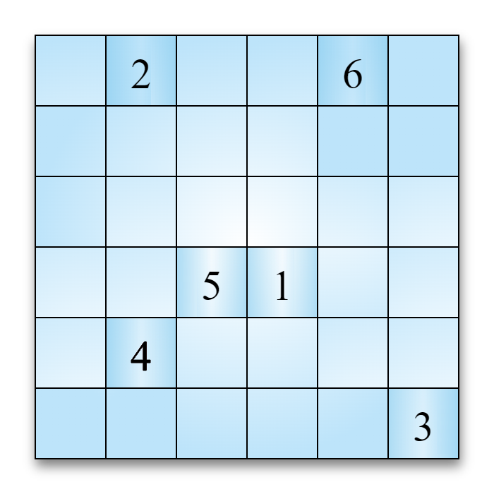
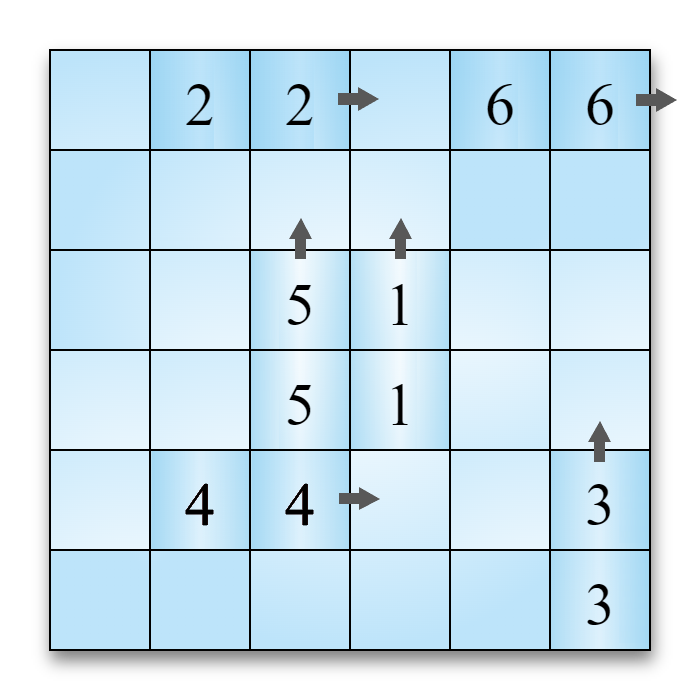
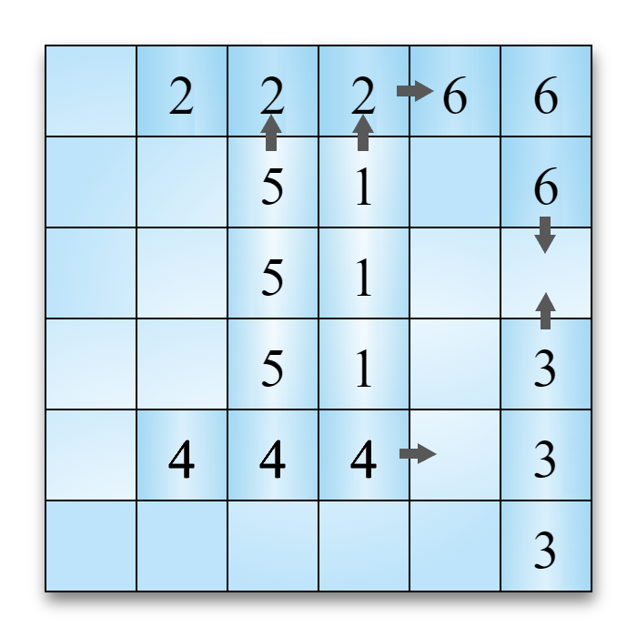
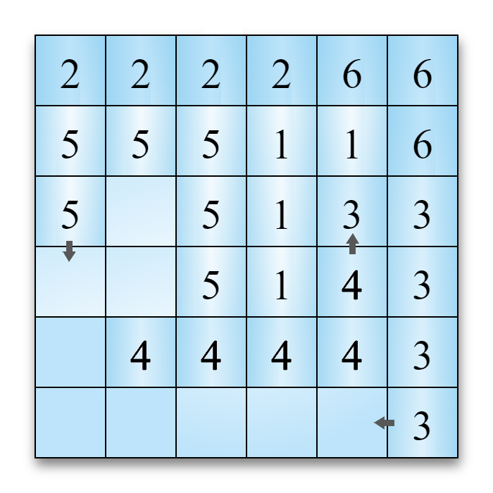
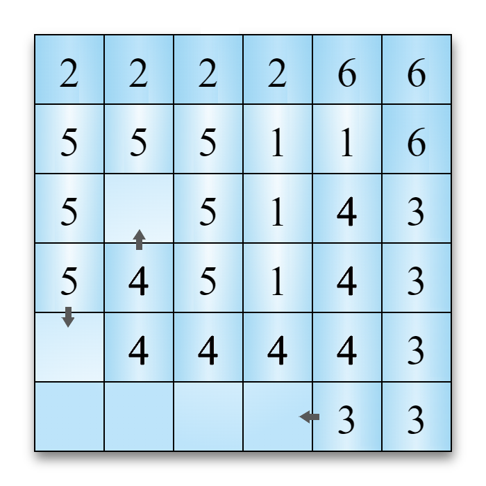
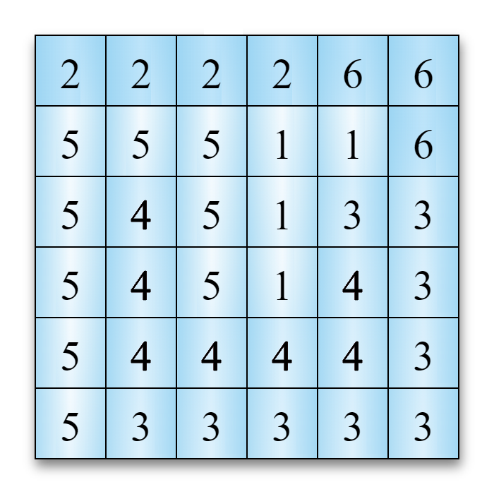
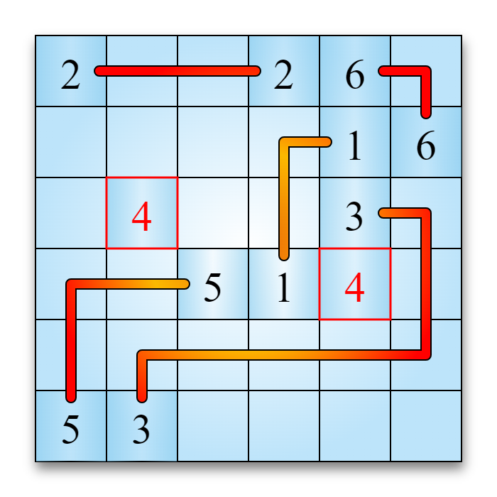

# Aufgabe 1 - Arukone

---

Dokumentation und Programmcode von Tymoteusz Wilk und Simon Reilich

## Lösungsidee

Die grundsätzliche Idee des Algorithmus ist, dass für jede Zahl möglichst komplexe und verwinkelte Pfade generiert werden, die sich trotzdem nicht überkreuzen. Dadurch ist eine Lösung des Rätsels garantiert immer möglich. Während des Entwicklungsprozesses war zuerst die Idee, die Pfade völlig zufällig generieren zu lassen, jedoch bildeten sich hier schnell “Schleifen” in den Pfaden, wodurch die Rätsel für das zur Verfügung gestellte Programm eigentlich immer gelöst wurden. Das brachte uns dazu, bei jeder Iteration zu prüfen, ob sich eine Schleife bilden würde, und wenn ja, eine andere Richtung auszuwählen, jedoch waren die sich ergebenden Rätsel immer noch nicht komplex genug. Deshalb entschieden wir uns doch gegen die komplett zufällige Richtung, und schrieben den Algorithmus so um, dass der Pfad die ganze Zeit in eine Richtung generiert wird und erst die Richtung wechselt, wenn ihm ein Hindernis im Weg steht. Hier erzielten wir schon deutliche bessere und brauchbarere Ergebnisse. 

Aber auch hier sahen wir uns mit zwei Problemen auseinandergesetzt: Manchmal breitete sich der Pfad so lange aus, dass er am Ende Kreise machte und wieder näher an der Startposition war. Dies lösten wir mit einem Limit auf der Länge des Pfades in Abhängigkeit von der Größe des Spielfelds. Ein Limit-Faktor 1.0 heißt also die Länge des Pfades darf nicht die Breite (oder Höhe) des Spielfelds übertreten. Das andere Problem war, dass die generierten Pfade teilweise sehr schnell stecken blieben, also in alle möglichen Richtungen blockiert waren (z.B weil dort schon andere Pfade generiert wurden). Deswegen haben wir uns dazu entschlossen nachdem das eine Ende des Pfades steckengeblieben ist, die Startposition des Pfades zu verschieben, also das andere Ende des Pfades analog zum vorherigen zu erzeugen. So wird auch versucht, dass es möglichst wenige leere Felder auf dem Spielfeld gibt und somit die Pfade so verwinkelt wie möglich sind.

In der folgenden Tabelle wird angegeben, wie sich das Limit und die hasAdjacent()-Methode (also das Überprüfen oder der Pfad dort wieder zurückgeht wo er bereits war) auf die Qualität der generierten Rätsel auswirken (Angabe: Wieviel Prozent der generierten Rätsel konnten von [https://www.arukone.bwinf.de/arukone](https://www.arukone.bwinf.de/arukone) nicht gelöst werden, höher ist besser, Testgröße: 1000 generierte Arukone-Rätsel, jeweils mit größe 6 und Anzahl an Zahlenpaaren 6):

| Faktor des Limits | mit hasAdjacent() | ohne hasAdjacent() |
| --- | --- | --- |
| 1.00 | 21,0% | 12,8% |
| 1.50 | 23,3% | 12.5% |
| 2.00 | 25,0% | 11,0% |
| 3.00 | 21,8% | 13,0% |
| kein Limit | 23,2% | 12,2% |

Wie man sehen kann hat die hasAdjacent-Methode eine sehr positive Auswirkung auf den Algorithmus. Auch lässt sich ein optimales Limit bei ca. 2,00 erkennen.

Und nun nochmal mit Limit-Faktor = 2,00 und mit Verwendung der hasAdjacent-Methode ausgeführt auf einem 6x6 Spielfeld, aber diesmal mit einer variablen Anzahl an Zahlenpaaren.

| 3 | 4 | 5 | 6 | 8 | 10 |
| --- | --- | --- | --- | --- | --- |
| 6,8% | 15,8% | 23,9% | 25,0% | 18,9% | 9,9% |

Also funktioniert der Algorithmus am besten, wenn die Anzahl der Zahlenpaare ~ Größe des Spielfelds

## Umsetzung

Die Lösungs-Idee wird in Java implementiert, die Größe des zu generierenden Arukone-Felds wird dem Programm beim Start im Terminal übergeben, sollte die Eingabe fehlerhaft sein, wird eine `IllegalArgumentException` geworfen und das Programm bricht ab.

Als nächstes wird zu jeder Zahl jeweils zufällig die Startposition mittels `java.util.Random` generiert.

```java
// Nun werden die zufälligen Startpositionen generiert.
Random random = new Random();
for (int i = 0; i < numbers; i++) {
	int x, y;
  do {
	  x = random.nextInt(0, size);
    y = random.nextInt(0, size);
    // Ist das Feld bereits besetzt, wird neu generiert.
	} while (paths[x][y] != 0);

  // Die entsprechende Stelle wird im paths-Array markiert, ...
  paths[x][y] = i + 1;
  // ... und die aktuellen Koordinaten werden in currentPos und startPos eingetragen.
  currentPos[i][0] = x;
  currentPos[i][1] = y;
  startPos[i][0] = x;
  startPos[i][1] = y;}
```

Es werden einmal die erzeugten Pfade, die Startpositionen und die aktuelle Positionen der Pfade abgespeichert. Bei den Pfaden muss auf das i 1 draufaddiert werden, da im Pfad-Array die 0 ein leeres Feld symbolisiert. Entsprechend müssen die Positionen neu gewürfelt werden bis an der Stelle auf dem Spielfeld keine Zahl steht, dies wird mithilfe der obenstehenden do-while-Schleife erreicht. `startPos` und `currentPos` sind beide Array der Länge `numbers`, können also für jede Zahl in dem dazugehörigen Unterarray der Länge 2 die Koordinaten auf dem Spielfeld speichern.

Bevor es zur Pfadgenerierung kommen kann, müssen 4 Hilfsvariablen initialisiert werden: `directions`, `iterations`, `limit`, und `isStuck`. `directions` speichert für jede Zahl die aktuelle Richtung des Pfades, hierbei steht 0 für eine noch nicht festgelegte Richtung, 1, 2, 3 und 4 jeweils für links, oben, rechts und unten. In `iterations`, wird die bisherige Zahl an Iterationen pro Pfad gespeichert, falls diese `limit` überschreitet, stoppt der Algorithmus mit der Berechnung des entsprechenden Pfades. `isStuck` ist dafür zuständig, zu speichern, inwiefern der Pfad blockiert ist, 0 steht in diesem Fall dafür, dass der Pfad sich weiterhin ausbreiten kann, 1 heißt, dass das vordere Ende blockiert ist, und bei 2 sind beide Enden blockiert.

Nun das Kernstück des Algorithmus:

```java
int j = size * size;
// j = Anzahl an Feldern
while (isAnyStuck(isStuck) && j > 0) {
	// Solange nicht alle Pfade blockiert sind und es noch genug freie Felder gibt.
	j--;

	for (int i = 0; i < numbers; i++) {

		// **Snippet 2**

		// **Snippet 3**

		// **Snippet 4**
	}
}
```

Die while-Schleife wird so lang ausgeführt bis der Pfad jeder einzelnen Zahl stecken geblieben ist. Es wird jede Zahl nacheinander einzeln betrachtet und der entsprechende Pfad um eine Einheit (falls möglich) verlängert.

```java
// Iteriere über alle Pfade
		if (isStuck[i]==2) continue;
		if (iterations[i] > limit) continue;
		// wenn der Pfad die maximale Anzahl an Iterationen überschritten hat

		// Wenn das eine Ende blockiert ist, wird am anderen weitergemacht
		int[] pos = isStuck[i] == 0 ? new int[] {currentPos[i][0], currentPos[i][1]} : 
				new int[] {startPos[i][0], startPos[i][1]};

		int direction = directions[i];
```

Es wird anfangs überprüft ob beide Enden des Pfades schon stecken geblieben sind oder die aktuelle Zahl ihr Limit an Iterationen erreicht hat. Falls das der Fall ist wird die aktuelle Iteration übersprungen. 

```java
if (direction == 0) {
			Collections.shuffle(possibleDirections);
			boolean stuck = true;
			for (Integer newDirection: possibleDirections) {
				int[] newPos = goInDirection(pos, newDirection);
				if (isValid(newPos, pos, paths)) {
					stuck = false;
					pos = newPos;
					direction = newDirection;
					break;
				}
			}
			if (stuck) {
				return runGenerator(args);
			}
```

Im nächsten Schritt wird überprüft ob die Richtung unserer Nummer gleich 0 ist, also dass noch keine Richtung zugewiesen wurde. Dies passiert für jede Nummer immer nur einmal, wobei in zufälliger Reihenfolge alle Richtungen ausprobiert werden, bis eine Richtung valide ist (also keine anderen Zahlen im Weg sind und der Pfad nicht auf dem Spielfeld austritt). `pos` stellt dabei nach der Ausführung des Code-Blocks für den Pfad die nächste Position dar (Am Ende der while-Schleife werden noch alle relevanten Variablen angepasst). Falls jedoch in diesem Abschnitt kein gültiger Weg gefunden wurde (angezeigt durch `stuck`) muss der Algorithmus erneut ausgeführt werden, da eine Zahl “umzingelt” wurde und somit kein Pfad mehr möglich ist. 

```java
else {
	pos = goInDirection(pos, direction);
	int[] oldPos = isStuck[i] == 0 ? currentPos[i] : startPos[i];
	if (!isValid(pos, oldPos, paths)) {
		boolean stuck = true;
		Collections.shuffle(possibleDirections);
		for (Integer newDirection: possibleDirections) {
			if (newDirection == direction) continue;
			int[] newPos = goInDirection(oldPos, newDirection);
			if (isValid(newPos, oldPos, paths)) {
				pos = newPos;
				direction = newDirection;
				stuck = false;
				break;
			}
		}
		if (stuck) {
			isStuck[i]++;
			continue;
		}
		if (isStuck[i]==2) continue;
	}
}
if (isStuck[i] == 0) currentPos[i] = pos;
else startPos[i] = pos;

directions[i] = direction;
paths[pos[0]][pos[1]] = i+1;
iterations[i]++;
```

Nach dem ersten ersten Durchlauf hat nun jede der Zahlen eine zugewiesene Richtung. In dem Fall wird der else-Teil ausgeführt. Wie schon zuvor muss erstmal überprüft werden, ob ein weiterer Schritt in die Richtung des Pfades, den Pfad ungültig machen würde. Falls nein werden natürlich die entsprechenden Variablen angepasst und der Algorithmus kann problemlos fortfahren. Ist die Richtung in die der Pfad gehen will jedoch blockiert, muss entweder eine neue Richtung ausgewählt werden oder das entsprechende Ende des Pfades als blockiert markiert werden. In der for-Schleife wird wieder in Zufälliger Reihenfolge jede einzelne noch mögliche Richtung ausprobiert. Falls keine der Richtungen gültig ist bleibt die äußere Variable `stuck` auf dem Wert `true` und der entsprechende Wert im`isStuck` Array wird inkrementiert. Wenn jedoch eine benutzbare Richtung in der Schleife gefunden wurde, wird `pos` und der Eintrag in `directions` aktualisiert. Falls sich nach den Durchläufen der Schleife rausstellt, dass der Wert in `isStuck` den Wert 2 hat also der Pfad an beiden Enden stecken bleibt, wird direkt zur nächsten Zahl gesprungen. 

So entsteht am Ende ein möglicher Pfad für eine Zahl der sich garantiert nicht mit anderen kreuzt 

## Beispiel

Im Folgenden wird ein beispielhafter Durchlauf des Algorithmus dargestellt:

Zuerst werden die Startpositionen zufällig verteilt, das könnte bei einem Feld der Größe 6 so aussehen:



Da noch keine Richtungen gewählt wurden, werden diese im ersten Durchlauf zufällig gewählt. Die erste Iteration sieht danach wie folgt aus:



Wie man oben bereits erkennen kann, muss für den Pfad 6 eine neue Richtung gewählt werden, da er aufgrund der Begrenzung durch das Feld nicht weiter nach rechts gehen kann. Es werden in zufälliger Reinfolge alle verfügbaren Richtungen durchgetestet, die einzige, die hier funktionieren kann ist nach unten:



Einige Iterationen später kommt es zu dieser Situation: Der Pfad mit der Nummer 4 könnte so nicht mehr weiter generiert werden, da Die Pfade Nummer 1 und 3 im Weg sind, jedoch ist um den Startpunkt herum noch relativ viel Platz.



Deshalb geht der Algorithmus für den betreffenden Pfad wieder an den Startpunkt und es wird von dort aus weitergeneriert:



Nachdem der Algorithmus vollständig durchlaufen ist, sehen die Pfade wie folgt aus:



Das zur Verfügung gestellte Programm findet keine Lösung:



Weitere Beispiele, die vom [Programm](https://www.arukone.bwinf.de/arukone) auf der BWINF-Seite nicht gelöst werden können:


.png)

.png)

.png)

.png)

.png)
